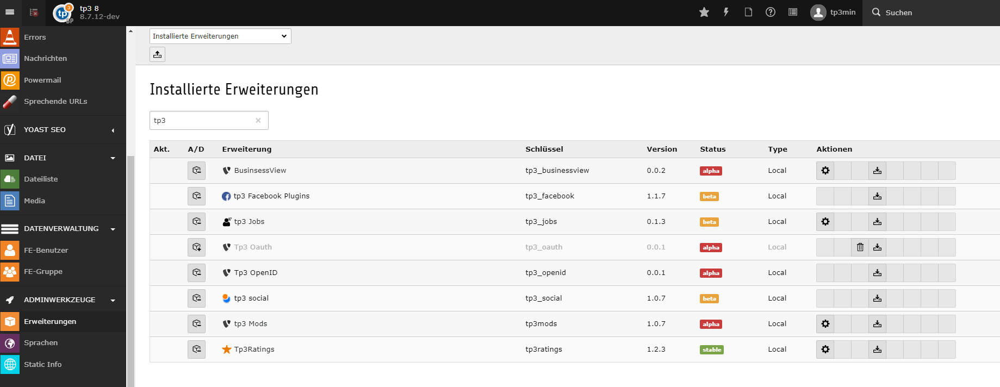

.. ==================================================
.. FOR YOUR INFORMATION
.. --------------------------------------------------
.. -*- coding: utf-8 -*- with BOM.

.. include:: ../Includes.txt

.. _admin-manual:

Administrator Manual
====================

Target group: **Administrators**

.. _admin-installation:

Installation
------------

the extention can be installed from the ter tp3_jobs
https://extensions.typo3.org/extension/tp3_jobs/

To install the extension, perform the following steps:

#. Go to the Extension Manager
#. You cann add tp3mods to have the advantage of further microdata
#. afterwards you should include the static template tp3_jobs or add the tssetup manualy

For a list of configuration options, using a definition list is recommended:

Some Configuration
  configure the storage pid in the contentelemt

Other configuration
  comming up is to select  a tt_address

   Extension Manager (tp3_jobs)

.. _admin-configuration:

Configuration
-------------

* You can counfigure the template (it's fluid).
 /Resources/Private/Partials/JobOffer/Properties.html:
* also some css can be helpful at some places...
* the mapping of microdata is not yet perfect - but help it to be Contribute at https://github.com/webtp3/tp3_jobs

.. _admin-faq:

FAQ
---

Possible subsection: FAQ

so questions asked yet.

Subsection
^^^^^^^^^^

Some subsection

Sub-subsection
""""""""""""""

Deeper into the structure...
